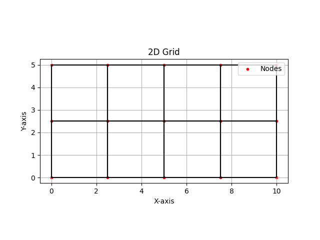
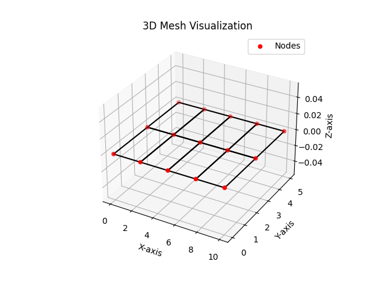
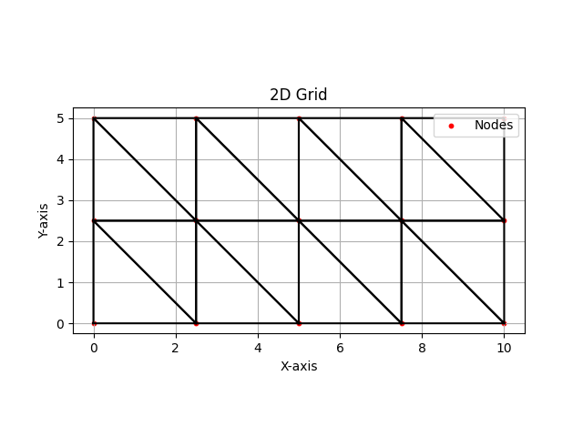
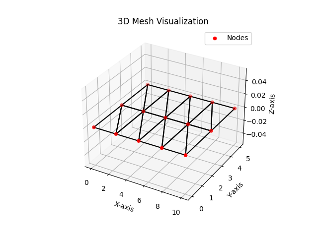
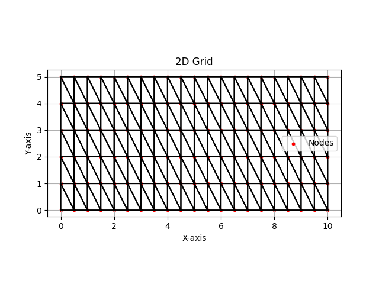
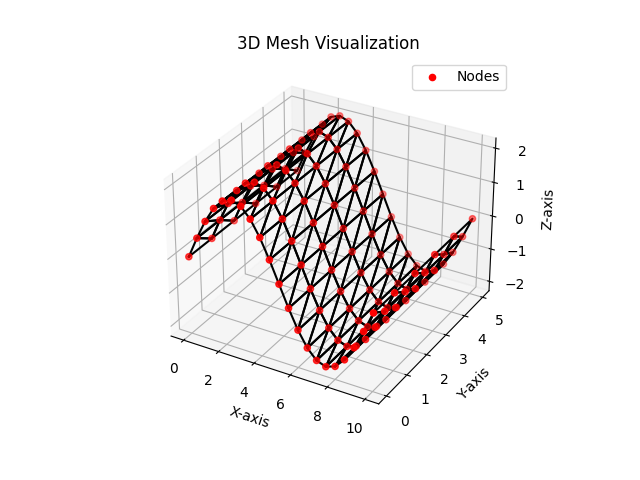
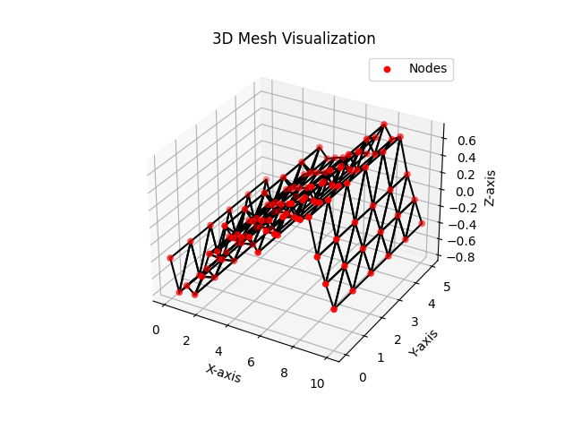
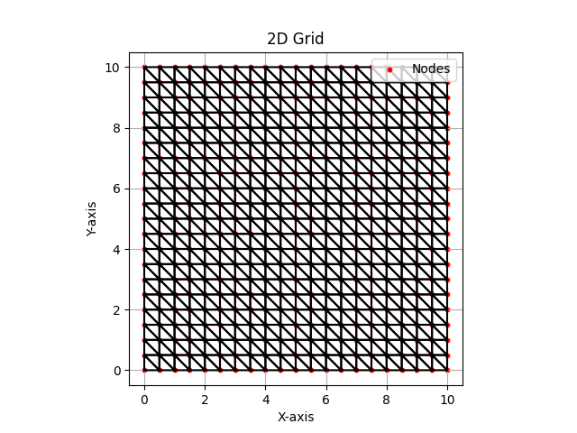
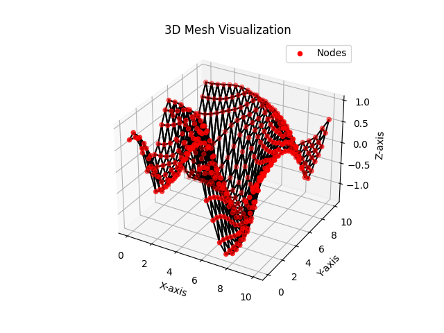
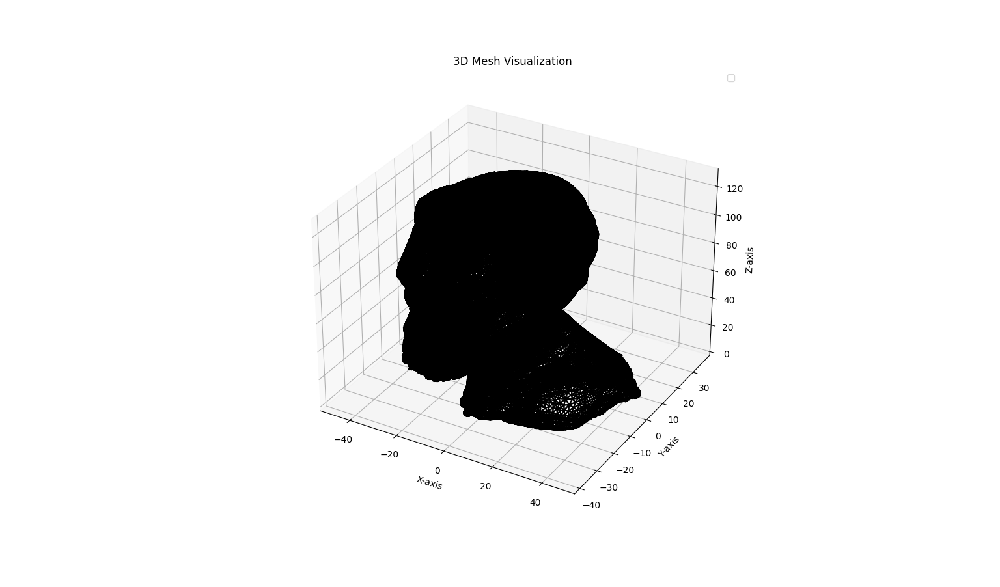

# Meshes Generated for TFE-TFG Marc Cruells Palomino

This repository contains various 2D and 3D meshes generated for the *task1-learn2mesh* project. Below is an overview of each mesh type, including Python and text data files, as well as visualizations of the generated grids.

## Mesh Data Format

Each mesh data is saved in the following formats:

- **Python format** (`.py`): This format contains the mesh data in Python script form, allowing you to directly load and manipulate the mesh using Python.
 
    ``` python
    # Import mesh_data from the saved_mesh package
    from saved_mesh import mesh_data

    # Example of how to use the imported module:
    print(mesh_data.nodes)  # Access nodes from mesh_data.py
    print(mesh_data.elements)  # Access elements from mesh_data.p
    ```
    Where `mesh_data` is the name of any of the meshes with the extension .py inside `saved-mesh` folder. This works if the folder structure is:
    ```bash
    task1-learn2mesh/
    ├── main.py  # Your main script
    └── saved-mesh/
        ├── __init__.py  # This makes saved-mesh a package
        └── mesh_data.py  # Your mesh data file

    ```
  
- **Text format** (`.txt`): This format is human-readable and contains the nodal and connectivity matrices, structured as follows:

    - **Nodal Matrix:**
      ```
      nodal matrix
      begin values
      i, x, y, (z)  # For 2D or 3D meshes
      ...
      end values
      ```

    - **Connectivity Matrix:**
      ```
      connectivity matrix
      begin values
      i, n1, n2, (n3), (n4)  # For triangles or quadrilaterals
      ...
      end values
      ```
- **STL format** (`.stl`): This format can be open using a CAD software (Blender, Solidworks, etc.). It can be also postprocessed in python using a external package from PIP.

## How to Use the Meshes' Utilities

**THIS SECTION IS HIDDEN UNTIL MARC IS ABLE TO VISUALISE ALL THE MESHES.**

1. Clone or download the repository.
2. Use the `meshing.py` module to save the generated mesh data.
3. Use the `plotting.py` module to visualize the meshes. **Marc should be able to recreate this module.**

---

## Mesh Types

**Create a plotting functoin and try to visualize the meshes in the following order.** 

*Nevetherless, the plotting function should be a 3d plot function that is able to work with triangular or quadrilateral meshes, and, for 2D and 3D meshes. Moreover, you should be able to load either the mesh from the .py or the .txt format.*

### 1. **Simple Rectangular Mesh**

- **Files:**
    - `malla_simple_data.py`: Python script with the mesh data.
    - `malla_simple_data.txt`: Human-readable text file containing nodal and connectivity matrix data.

- **Description:**
    This is a simple rectangular grid mesh where the nodes are evenly spaced in the x and y directions. It is often used as a basic starting point for mesh generation and analysis.

- **Visualization:**




---

### 2. **Simple Triangular Mesh**

- **Files:**
    - `malla_simple_tri_data.py`: Python script with the mesh data.
    - `malla_simple_tri_data.txt`: Human-readable text file containing nodal and connectivity matrix data.

- **Description:**
    This is a triangular mesh formed over a rectangular domain. It consists of nodes arranged in a grid with triangular elements defined by the connectivity matrix.

- **Visualization:**





---


### 3. **1D Wave Mesh**

- **Files:**
    - `malla_onda_1d_data.py`: Python script with the mesh data.
    - `malla_onda_1d_data.txt`: Human-readable text file containing nodal and connectivity matrix data.

- **Description:**
    A 1D wave mesh is generated based on a sinusoidal wave pattern with defined frequencies and amplitudes. The mesh is represented in 1D, but with a 3D visualization showing the wave displacement.

- **Visualization:**




---

### 4. **1D Irregular Wave Mesh (Data)**

- **Files:**
    - `mesh_onda_1d_irregular_data.py`: Python script with the mesh data for the 1D irregular wave.

- **Description:**
    This mesh represents a 1D wave with irregular displacements based on random phases, defined frequencies, and amplitudes. It provides an irregular wave profile for testing and analysis.




---


### 5. **2D Irregular Wave Mesh**

- **Files:**
    - `malla_onda_2d_irregular_data.py`: Python script with the mesh data.

- **Description:**
    This mesh represents a 2D irregular wave pattern. It has been generated using random perturbations along the x and y directions.

- **Visualization:**




---

### 6. **Head Mesh (Irregular)**

- **Files:**
    - `malla_head_irregular_data.py`: Python script with the mesh data.
    - `malla_head_irregular_data.stl`: STL file for 3D representation.
    - `malla_head_irregular_data.txt`: Human-readable text file containing nodal and connectivity matrix data.

- **Description:**
    This mesh is based on an irregular head shape. It represents a 3D triangular non-structured mesh and is stored in multiple formats (Python script, STL, and text).

- **Visualization:**



---

## License

This project is licensed under the MIT License - see the [LICENSE](LICENSE) file for details.

